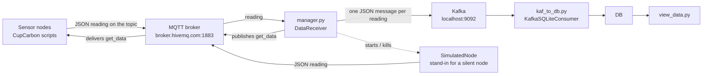

# smart-city-iot-pipeline

An end-to-end telemetry pipeline for a simulated smart city. Sensor nodes running inside the CupCarbon
simulator publish JSON readings over MQTT; a manager process polls those nodes on an adaptive schedule,
batches what comes back and republishes it to Kafka; a threaded consumer drains Kafka into SQLite, one
table per sensor topic; a small CLI prints the stored data. The manager also covers for nodes that stop
answering by starting an in-process stand-in that publishes under the same node id until the real node
returns. Container images and Kubernetes manifests are included, with one deployment and one horizontal
pod autoscaler rendered per topic so that a busy sensor stream scales independently of a quiet one.

## Architecture



The topic name is the unit of partitioning throughout. The same string names the MQTT topic, the Kafka
topic, the SQLite table and the Kubernetes deployment, so a topic can be traced from sensor to table
without a lookup. The five topics the node scripts implement are `temperature`, `pm2_5`,
`air_pollution`, `traffic_data` and `water_consumption`.

## Components

**Sensor nodes** — `scripts_for_cupcarbon/*.py`. One script per sensor topic, written for CupCarbon's
Python node interface: the script prints a request keyword (`getid`, `getname`, `getx`, `gety`) and
reads the node's own attribute back on stdin. Each node subscribes to its topic, and on receiving the
literal message `get_data` publishes a JSON object carrying node id, name, x/y position, date, time and
the sensor value.

**Manager** — `files/interoperable_layer/manager/manager.py` (`DataReceiver`). Subscribes to the topic,
parses the JSON lines out of each payload, buffers them and flushes to a `KafkaProducer` once the batch
size is reached. Three behaviours sit on top of that path:

- *Adaptive polling.* A background thread publishes `get_data` on the topic in a loop. The delay between
  polls moves between 5 s and 60 s, increasing when the observed MQTT-to-Kafka time exceeds the 200 ms
  target and decreasing when it falls below it.
- *Stand-in nodes.* Every node id that reports is timestamped. When a node has not reported inside the
  inactivity threshold, a `SimulatedNode` (`simulate_node.py`) is started for that id and publishes
  numpy-drawn values under the name `VirtualNode`; it is killed as soon as a real message arrives for
  the id again.
- *Live plots.* A matplotlib window refreshed every 5 s tracks CPU utilisation, response time in
  milliseconds and polling frequency.

**Kafka-to-SQLite consumer** — `files/interoperable_layer/kafka_to_db/kaf_to_db.py`
(`KafkaSQLiteConsumer`). Creates the topic through `KafkaAdminClient` if it does not exist, then runs
five `KafkaConsumer` threads in a `ThreadPoolExecutor`, polling with a 1 s timeout and up to 100 records
a call. The table is created from the keys of the first message seen, every column typed `TEXT`, and a
recent-window snapshot of each batch is written out to `fresh_data.json`.

**Viewer** — `files/view_data.py`. Selects everything from the table named after the topic and prints it
as a grid using `tabulate`.

**Deployment driver** — `files/deployment/deploy.py`. Substitutes `{{ topic }}` into the deployment, HPA
and CronJob templates for each topic in its list and applies each rendered manifest with `kubectl apply`.

## Stack

- Python 3.12 (the committed virtualenv is 3.12.2; the images build on `python:3.9`)
- MQTT — `paho-mqtt` 2.0.0 against the public HiveMQ broker at `broker.hivemq.com:1883`
- Apache Kafka — `kafka-python-ng` 2.2.0, broker run from the `apache/kafka` image
- SQLite via the standard-library `sqlite3` module
- numpy 1.26.4 for synthetic sensor values, matplotlib 3.8.4 for the live plots, tabulate 0.9.0 for the CLI
- Docker, one image per pipeline stage
- Kubernetes — Deployment, HorizontalPodAutoscaler and CronJob manifests, templated per topic
- CupCarbon as the node/mobility simulator hosting the sensor scripts

## Repository layout

```
scripts_for_cupcarbon/           sensor node scripts, one per topic, run inside CupCarbon
  air_pollution.py
  pm2_5.py
  temperature.py
  traffic_data.py
  water_consumption.py

files/
  How_to_Run.txt                 the original local run notes
  requirements.txt               pinned runtime dependencies
  view_data.py                   CLI that prints a topic's SQLite table

  interoperable_layer/
    manager/
      manager.py                 MQTT subscriber, adaptive poller, Kafka producer
      simulate_node.py           stand-in node used when a real node goes silent
      topics.py                  creates one data-receiver deployment per topic via kubectl
      manager_deployment.yaml    untemplated single-replica Deployment
      Dockerfile
    kafka_to_db/
      kaf_to_db.py               threaded Kafka consumer writing into SQLite
      Dockerfile

  deployment/
    deploy.py                    renders and applies the per-topic manifests
    data_receiver_deployment.yaml   Deployment template, {{ topic }} placeholder
    data_receiver_hpa.yaml          HorizontalPodAutoscaler template
    kaf_cronjob.yaml                CronJob template for the consumer

```

## Running it locally

The three Python processes all resolve their files relative to the working directory, so run them from
`files/`. Each takes the topic as its single argument and defaults to `temperature`.

Install the dependencies:

```
pip install -r files/requirements.txt
```

Start a Kafka broker, then the manager, the consumer and the viewer, each in its own terminal, in that
order — these are the commands recorded in `files/How_to_Run.txt`:

```
docker run -d -p 9092:9092 apache/kafka

cd files
python interoperable_layer/manager/manager.py temperature
```

```
cd files
python interoperable_layer/kafka_to_db/kaf_to_db.py temperature
```

```
cd files
python view_data.py temperature
```

stand-ins, load the matching script from `scripts_for_cupcarbon/` onto the nodes in a CupCarbon project
and run the simulation; the nodes and the manager rendezvous on the public HiveMQ broker.

## Kubernetes deployment

Build and push one image per stage:

Both Dockerfiles use `files/` as the build context so they can pick up the shared `requirements.txt`:

```
cd files
docker build -f interoperable_layer/manager/Dockerfile     -t <registry>/data-receiver:dev .
docker build -f interoperable_layer/kafka_to_db/Dockerfile -t <registry>/kaf:dev .
```

Each image takes the topic as its container argument, which is what the manifests pass through `args`.

Set the image names in the manifests, then either drive the whole set through the deployment script:

```
cd files/deployment
python deploy.py
```

or render and apply a single topic by hand:

```
sed 's/{{ topic }}/temperature/g' files/deployment/data_receiver_deployment.yaml | kubectl apply -f -
sed 's/{{ topic }}/temperature/g' files/deployment/data_receiver_hpa.yaml       | kubectl apply -f -
sed 's/{{ topic }}/temperature/g' files/deployment/kaf_cronjob.yaml             | kubectl apply -f -
```

`files/interoperable_layer/manager/manager_deployment.yaml` is the untemplated single-topic equivalent
and applies directly with `kubectl apply -f`. The consumer runs as a CronJob on a `*/5 * * * *`
schedule with `restartPolicy: OnFailure`, rather than as a long-lived deployment.

## Scaling

Scaling is per topic. `deploy.py` renders one Deployment and one HorizontalPodAutoscaler for every topic
in its list, so each sensor stream gets its own replica pool and its own autoscaler and a spike on one
topic does not resize the others.

The autoscaler in `files/deployment/data_receiver_hpa.yaml` targets the per-topic
`data-receiver-{{ topic }}` deployment, scales between 1 and 10 replicas, and uses average CPU
utilisation with an 80% target. The pods it scales request 100m CPU and 128Mi of memory and are limited
to 500m and 256Mi, so a topic's ceiling is 5 CPU and 2.5Gi across the ten replicas.

There is a second, softer scaling mechanism inside the manager: the adaptive poller widens the interval
between `get_data` requests when the measured MQTT-to-Kafka time drifts above target and narrows it when
there is headroom, which trades freshness against broker load before any pod is added.

## Known limitations

The application code is as it was written in April 2024; the packaging around it (requirements, Dockerfiles, manifest API versions) was repaired in 2026. Rough edges that remain, named rather than hidden:

- The `fresh_data.json` snapshot parses only the `time` field with `%H:%M:%S`, which dates every row to
  1900, so the one-hour filter always passes and the snapshot is the whole batch.
- Both the manager and the consumer connect to `localhost:9092` and `broker.hivemq.com` as hard-coded
  constants; there is no configuration layer.
- Table columns are inferred from the first message and all typed `TEXT`, and the SQL is built by string
  interpolation of the topic name — fine for a fixed set of trusted topics, not for untrusted input.
- `inactive_node_threshold` defaults to 0, so the virtual-node failover treats every node as silent
  and fires on each poll.

## Attribution

The sensor nodes are written for CupCarbon, an external smart-city and wireless-sensor-network
simulator, and follow its convention of exchanging node attributes with the host
simulator over stdin. Messaging uses HiveMQ's free public broker at `broker.hivemq.com`, and the local
installed from PyPI — numpy, matplotlib, paho-mqtt, kafka-python-ng, Pillow, fontTools, psutil, tabulate
and their dependencies — each under its own licence as recorded in its `dist-info` directory; none of it
is original to this repository. All application code under `files/interoperable_layer/`,
`files/deployment/`, `files/view_data.py` and `scripts_for_cupcarbon/` was written for this project.

## Status

Built in April 2024 as a course project and not maintained since. The repository does not
record which course it was submitted for. It is published as a record of the design, not as software
under active development.
